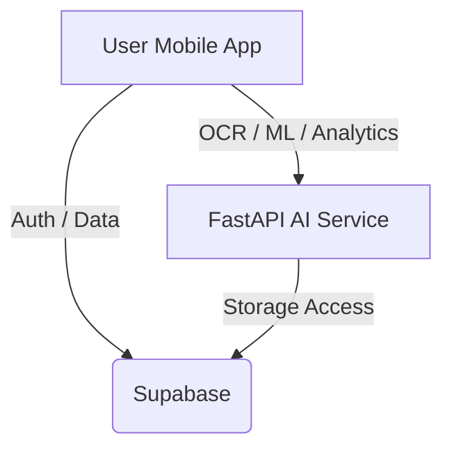

# Project Onboarding & Architecture

Welcome to the **Family Expense Tracker** project! This document provides a deep dive into the system architecture, how each component works, and how to get everything running.

## 🏗️ Architecture Overview

The project follows a modern mobile-first architecture:

1.  **Frontend (Mobile App)**: Built with **React Native** and **Expo**. It handles the UI, user interactions, and local state management.
2.  **Backend (AI Service)**: A **Python FastAPI** service that provides advanced features like AI-powered expense analytics, anomaly detection, and OCR (Optical Character Recognition) for receipt scanning.
3.  **Database & Auth**: **Supabase** acts as the backend-as-a-service, handling user authentication, real-time database updates, and file storage for receipts.

---

## 🐍 Backend Deep Dive

The backend is located in the `/backend` directory.

### Core Components
- **`main.py`**: The entry point. Defines FastAPI endpoints for analytics, recommendations, anomalies, and OCR.
- **`ml_pipeline.py`**: Contains the `MLPipeline` class.
    - **Clustering**: Uses `KMeans` to group expenses and identify spending patterns (e.g., "Regular spending on groceries on Mondays").
    - **Anomaly Detection**: Uses `IsolationForest` to detect unusual spending spikes or outliers.
    - **Recommendations**: Generates proactive tips based on detected patterns and anomalies.
- **`ocr_service.py`**: Integrates with **OpenAI's GPT-4o** to scan receipt images (base64) and extract structured data (amount, date, category, notes).

### How to Run
1.  Navigate to `/backend`.
2.  Create and activate a virtual environment (`python -m venv venv`).
3.  Install dependencies: `pip install -r requirements.txt`.
4.  Configure `.env` with your `OPENAI_API_KEY`.
5.  Start the server: `python main.py` or `uvicorn main:app --reload`.
    - Server runs at: `http://localhost:8000`

---

## 📱 Frontend Deep Dive

The frontend is located in the `/FamilyExpenseTracker` directory.

### Core Components
- **State Management**: Uses **Zustand** (found in `/store`) for a clean, hook-based state management system.
- **Services**:
    - **`supabaseClient.js`**: Handles all direct communication with Supabase (Auth, CRUD operations for expenses/groups).
- **Navigation**: Uses **React Navigation** (`/navigation`) for tab-based and stack-based routing.
- **UI Components**: Built using **React Native Paper** for a consistent Material Design look.

### How to Run
1.  Navigate to `/FamilyExpenseTracker`.
2.  Install dependencies: `npm install`.
3.  Configure `.env` with `EXPO_PUBLIC_SUPABASE_URL` and `EXPO_PUBLIC_SUPABASE_ANON_KEY`.
4.  Start Expo: `npx expo start`.
5.  Open on a physical device via Expo Go or use an emulator/simulator.

---

## 🗄️ Database Schema

The database is hosted on Supabase. The schema (`Schema.sql`) includes:
- **`profiles`**: User profile information linked to Supabase Auth.
- **`groups`**: Family/Social groups for shared tracking.
- **`group_members`**: Mapping of users to groups with roles (owner, member).
- **`expenses`**: Individual expense records with categories, amounts, and receipt URLs.

Check `Schema.sql` in the root for the full SQL definitions and RLS (Row Level Security) policies.
